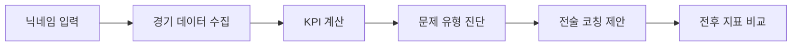
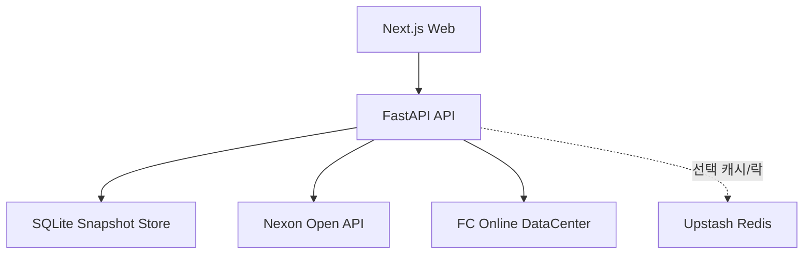

<div align="center">

# FCOACH

FC Online 경기 데이터를 분석해 플레이 문제를 진단하고, 액션 제안과 효과 검증까지 연결한 데이터 기반 코칭 서비스

[서비스](https://fcoach.fun) · [API Docs](https://fcoach-api.vercel.app/docs) · [GitHub](https://github.com/minzai0116/fcoach)

</div>

## 핵심 성과

- Nexon Open API와 FC Online DataCenter 데이터를 수집해 사용자 경기 데이터를 분석 가능한 형태로 정리했습니다.
- 데이터 수집, KPI 계산, 문제 진단, 액션 제안, FastAPI 분석 API, Next.js 웹 화면, Vercel 배포까지 직접 구현했습니다.
- 단순 전적 조회가 아니라 `진단 -> 개입 -> 검증` 흐름으로 이어지는 서비스 경험을 설계했습니다.
- 스냅샷, 실험 기록, 클릭 이벤트를 저장해 서비스 사용과 개선 여부를 추적할 수 있는 구조를 만들었습니다.

## 프로젝트 개요

| 항목 | 내용 |
| --- | --- |
| 한줄 요약 | 경기 로그를 분석해 플레이 문제와 개선 액션을 함께 제시하는 코칭 서비스 |
| 대상 도메인 | FC Online 경기 분석 |
| 핵심 가치 | 결과 지표를 보여주는 것에서 끝나지 않고, 다음 행동까지 제안 |
| 주요 데이터 | Nexon Open API, FC Online DataCenter |
| 서비스 구성 | Next.js 웹, FastAPI 분석 API, SQLite 기반 스냅샷 저장 |
| 배포 환경 | Vercel(Web/API) |

## 문제 해결 흐름

기존 전적 조회 서비스는 승률, 득점, 실점 같은 결과 지표를 잘 보여줍니다. 하지만 사용자가 다음 경기에서 무엇을 바꿔야 하는지까지 연결해 주는 경우는 많지 않습니다.

FCOACH는 이 문제를 해결하기 위해 최근 경기 데이터를 기반으로 문제 유형을 진단하고, 우선순위 액션과 검증 지표를 함께 제시합니다.



## 구현 범위

- 닉네임 기반 OUID 조회와 분석 실행 흐름 구현
- 공식전/친선전, 최근 5·10·30경기 구간별 플레이 패턴 비교
- 후반 실점, 찬스 생성, 마무리, 오프사이드 등 세부 이슈 점수화
- 문제 원인별 전술 코칭과 전술 변경 가이드 제공
- 랭커 기준 비교와 유사 성향 랭커 후보 제공
- 선수 리포트에서 포지션 배치, 시즌/강화, 상세 성과표 제공
- 클릭, 탭, 실행 이벤트 기록을 통한 운영 지표 추적

## 시스템 구조



- Web은 분석 요청과 결과 렌더링을 담당합니다.
- API는 외부 데이터를 수집하고 정규화한 뒤 분석 결과와 실험 로그를 생성합니다.
- 저장 계층은 스냅샷, 실험 기록, 이벤트 로그를 관리합니다.
- Redis는 선택 구성으로, Vercel 인스턴스 간 캐시와 중복 요청 방지 락을 공유합니다.
- 읽기 경로와 동기화 경로를 분리해 사용자 체감 지연을 줄였습니다.

## 기술 스택

- 웹: `Next.js 15`, `React 19`, `TypeScript`
- API: `FastAPI`, `Pydantic`
- DB: `SQLite`
- Cache: `Redis` 선택 구성
- 데이터: `Nexon Open API`, `FC Online DataCenter`
- 배포: `Vercel`

## 로컬 실행

```bash
git clone https://github.com/minzai0116/fcoach.git
cd fcoach
cp .env.example .env
cp apps/web/.env.example apps/web/.env.local
make init
make init-db
```

필수 환경 변수:

```bash
NEXON_OPEN_API_KEY=YOUR_NEXON_OPEN_API_KEY
# 선택: Vercel 다중 인스턴스 캐시/락 공유
REDIS_URL=rediss://...
```

`apps/web/.env.local`:

```bash
NEXT_PUBLIC_API_BASE_URL=http://127.0.0.1:8000
```

실행:

```bash
make api
cd apps/web && npm install && npm run dev
```

## 주요 API

- `GET /users/search?nickname=...`
- `POST /analysis/run`
- `GET /analysis/latest?ouid=...&match_type=52&window=30`
- `GET /actions/latest?ouid=...&match_type=52&window=30`
- `POST /experiments`
- `GET /experiments/evaluation?ouid=...&match_type=52`

## 배포 및 한계

- 현재 공개 서비스는 `Vercel(Web/API)` 기준의 데모 배포입니다.
- API가 serverless 환경에서 로컬 SQLite를 사용하므로 스냅샷, 실험 기록, 이벤트 로그는 지속 저장되지 않습니다.
- 장기 운영 기준에서는 관리형 DB 또는 persistent volume이 있는 환경으로 전환이 필요합니다.
- 자세한 배포 절차는 [docs/DEPLOYMENT.md](docs/DEPLOYMENT.md)에 정리했습니다.

## 라이선스 및 고지

- 소스코드 라이선스: MIT ([LICENSE](LICENSE))
- FC Online 관련 데이터, 상표, 이미지 권리는 각 권리자에게 있습니다.
- 본 프로젝트는 비공식 팬 프로젝트이자 포트폴리오 용도로 제작했습니다.
